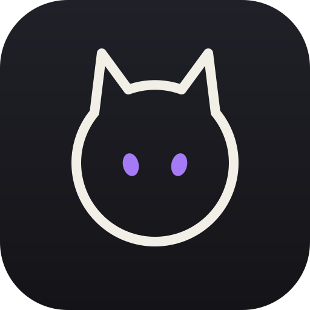

<p align="center">
  
</p>

<h1 align="center">Neko</h1>

<p align="center">A quiet, native wallpaper manager for Windows.</p>

<p align="center">
  <a href="LICENSE"></a>
  <a href="https://github.com/alvyn16/Neko/releases"></a>
  <a href="https://github.com/alvyn16/Neko/actions/workflows/release.yml"></a>
  
</p>

## Preview

<!-- TODO: Add a concise screenshot or GIF of the gallery and wallpaper preview here. -->

> TODO: Replace this placeholder with `docs/images/neko-preview.gif` (or a screenshot) and update the alt text.

## Features

- Browse a local wallpaper folder with cached previews, then apply images to all displays or a selected monitor.
- Search Wallhaven's SFW API and browse the curated `bjarneo/wallpapers` catalog.
- Save online images to the local folder, import images by drag and drop, and manage files from the gallery.
- Choose Fill, Fit, Stretch, Center, or Tile placement and rotate local wallpapers while Neko is running.
- Check GitHub Releases and install verified updates.

## Install

### Installer

Download [Neko-Setup-x64.exe](https://github.com/alvyn16/Neko/releases/latest/download/Neko-Setup-x64.exe) from the latest release and run it. The per-user installer adds a Start Menu shortcut, can create a desktop shortcut, and includes an uninstaller.

### Build from source

Install the stable Rust MSVC toolchain and Windows build tools, then run:

```powershell
cargo run --release
```

To create distributable artifacts, use:

```powershell
powershell -ExecutionPolicy Bypass -File scripts/build-release.ps1
```

For the Windows installer, install [Inno Setup 6](https://jrsoftware.org/isinfo.php) and run:

```powershell
powershell -ExecutionPolicy Bypass -File scripts/build-installer.ps1
```

## Quickstart

1. Start Neko and choose a wallpaper folder with `Ctrl+O`.
2. Select an image to open its preview, then choose a monitor to apply it.
3. Use the gear button for placement, display targeting, rotation, and update settings.
4. Switch sources to browse local images, Wallhaven, or the bjarneo catalog; use `Ctrl+F` to search and `Enter` to submit.

`F5` refreshes the current collection. `Esc` closes a preview or dialog.

<details>
<summary>Security &amp; privacy</summary>

Neko validates image input before opening it: 100 MiB encoded, 80 megapixels, 16,384 pixels per side, and 512 MiB decoded allocation. Network requests use HTTPS, provider-host allowlisting, bounded responses, and explicit timeouts. Settings and provider/image caches remain on the device; set `NEKO_DATA_DIR` to a writable directory to keep both in one location. Neko has no account, telemetry, favorites service, or cloud upload.

See [testing and limits](docs/TESTING.md) for verification commands and further detail.
</details>

## Sources & credits

- [Wallhaven](https://wallhaven.cc/) provides the SFW search source.
- [bjarneo/wallpapers](https://github.com/bjarneo/wallpapers) provides the curated catalog source.

Neko does not bundle or redistribute wallpapers. It fetches online images only on demand when you choose to apply or save them; use of those images is subject to their respective terms and licenses.

## Contributing

See [CONTRIBUTING.md](CONTRIBUTING.md) for development, testing, and issue guidelines. Third-party notices are in [docs/THIRD_PARTY.md](docs/THIRD_PARTY.md).
